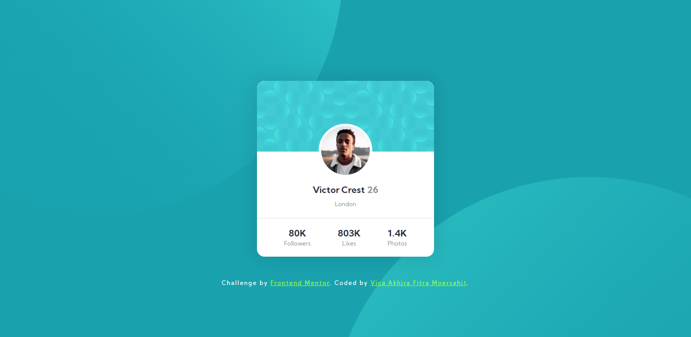

# Frontend Mentor - Stats preview card component solution

This is a solution to the [Profile card component challenge on Frontend Mentor](https://www.frontendmentor.io/challenges/profile-card-component-cfArpWshJ).

## Table of contents

- [Overview](#overview)
  - [The challenge](#the-challenge)
  - [Screenshot](#screenshot)
  - [Links](#links)
- [My process](#my-process)
  - [Built with](#built-with)
  - [Continued development](#continued-development)
  - [Useful resources](#useful-resources)
- [Author](#author)

## Overview

### The challenge

Users should be able to:

- View the optimal layout depending on their device's screen size

But i have a problem how i set the position and size of the two images used for the background. is there a better way than the one i made?

### Screenshot

### Links

- Solution URL: [Click Here!](https://www.frontendmentor.io/solutions/profile-card-component-for-frontend-mentor-without-framework-6DDDfP4te)
- Live Site URL: [Click Here!](https://vicaakhira26.github.io/-Profile-card-component-for-Frontend-Mentor-without-framework/)

## My process

### Built with

- Semantic HTML5 markup
- CSS custom properties
- Flexbox
- Mobile-first workflow

### Continued development

next time i will try re-create this challenge with popular framework like bootstrap, react, and tailwind

### Useful resources

- [W3School](https://www.w3schools.com/) - This site helped me alot for learning basic HTML and CSS.

## Author

- Frontend Mentor - [@VicaAkhira26](https://www.frontendmentor.io/profile/VicaAkhira26)
